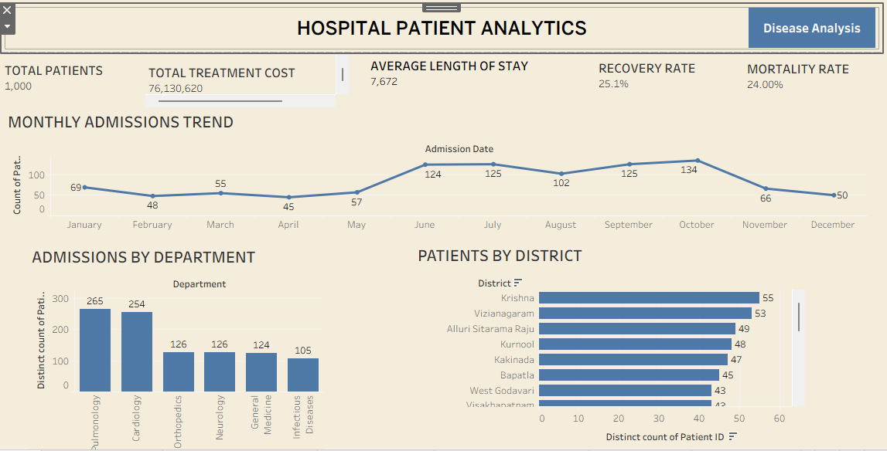
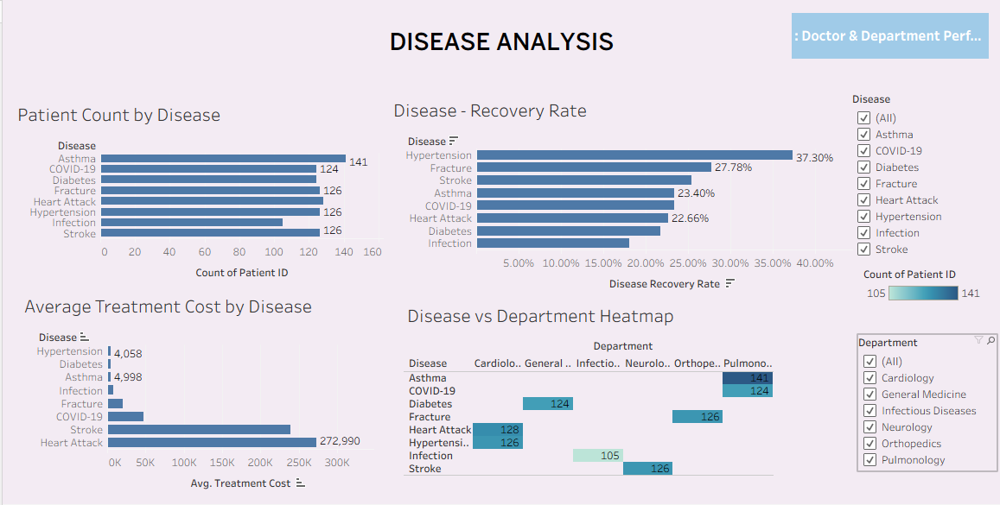
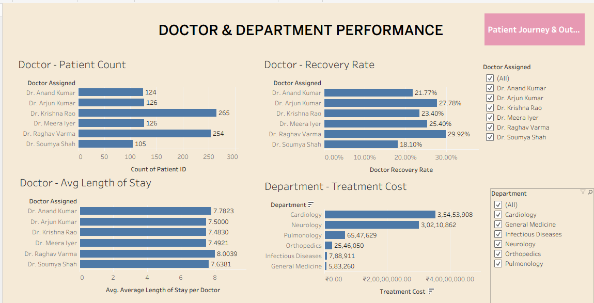
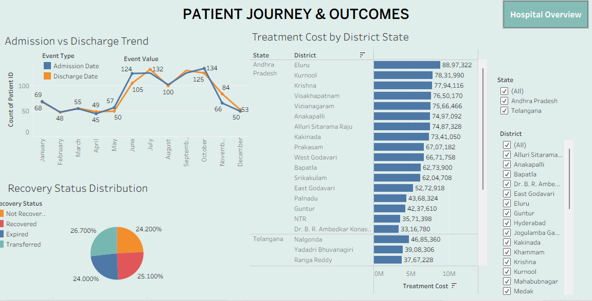

# Tableau Analytics Project

## 📊 Project Overview

This project is an interactive Tableau data analytics project designed to transform data into meaningful insights through dashboards, charts, filters, and interactive visualizations.

The project demonstrates practical skills in data analysis, data visualization, dashboard development, and analytical storytelling using Tableau.

## 🎯 Project Objectives

- Analyze the dataset using Tableau
- Create interactive visualizations
- Identify important trends and patterns
- Build an interactive dashboard
- Use filters to explore the data
- Present meaningful business insights

## 🛠️ Tools & Technologies

- Tableau
- Data Visualization
- Dashboard Development
- Data Analysis
- Interactive Filters
- Business Intelligence

## 📂 Project Files

| File | Description |
|---|---|
| `Tableau assignment(kumar).twbx` | Complete packaged Tableau workbook |
| `Final Tableau assignment insight.docx` | Project insights and analysis |
| `Dashboard-1.png` | Tableau dashboard screenshot |
| `Dashboard-2.png` | Tableau dashboard screenshot |
| `Dashboard-3.png` | Tableau dashboard screenshot |
| `Dashboard-4.png` | Tableau dashboard screenshot |

## 🔄 Project Workflow

Raw Data  
↓  
Data Preparation  
↓  
Data Analysis  
↓  
Tableau Visualization  
↓  
Dashboard Development  
↓  
Business Insights

## 📈 Dashboard Features

- Interactive Tableau dashboard
- Charts and visualizations
- Filters and interactive controls
- Trend analysis
- Comparative analysis
- Data-driven insights

## 📸 Tableau Dashboard Preview

### Dashboard 1

### Dashboard 2

### Dashboard 3

### Dashboard 4

## 💡 Key Skills Demonstrated

- Tableau
- Data Visualization
- Dashboard Development
- Data Analysis
- Interactive Reporting
- Analytical Thinking
- Business Intelligence

## 🚀 How to Open the Project

1. Download `Tableau assignment(kumar).twbx`.
2. Open the file using Tableau Desktop.
3. Explore the dashboards and worksheets.
4. Use the available filters and interactive features.

## 📄 Project Insights

Detailed project findings and analysis are available in:

`Final Tableau assignment insight.docx`

## 👤 Author

**Banti Das**

Aspiring Data Analyst | Python | SQL | Excel | Power BI | Tableau
